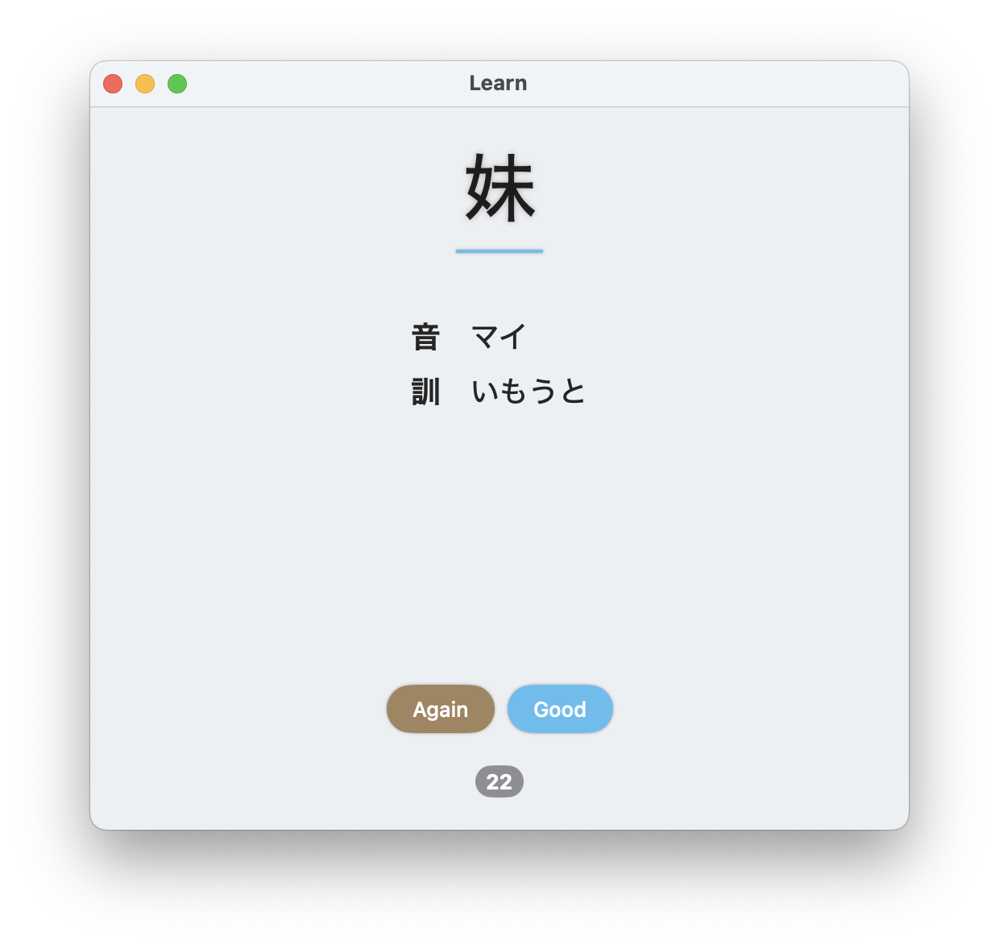

# A kanji app

This is simple flashcards app, specifically tuned to learning kanji. All readings (*yomi*) are fetched from [Kanjipedia](https://www.kanjipedia.jp).



## Learning

Every card has three states:
- *New* – for new or forgotten card,
- *Repeat* – card was just remembered, should be recalled in the next session,
- *Learned* – card was remembered well.

So if you are good at remembering, state progresses sequentially:
*New --(good)--> Repeat --(good)--> Learned*

Although the app takes hardcore approach, if you don't remember card, state always resets:
*Repeat/Learned --(again)--> New*

There are a couple of shortcuts: In *Learn* window you can press `space` to show back side, and `space` again to mark success, or `x` to mark failure. You can also undo your answers with `⌘Z`.

### Settings

You can change certain learning parameters in Settings window (*Window -> Settings*):
- Total maximum of cards, 0 is infinity,
- Maximum number of additional cards, i.e. not marked for repeating,
- Ratio between new and learned cards in that amount.

## Import, export and editing

You can import the first portion of cards in Database window (*Window -> Database*) with *Database -> Import*. File should have CSV format with two columns separated by semicolon: kanji and integer (0 is *New* and so on). If you don't specify status, in other words, if only kanji is provided, then status reads as *New*. You can export database in this format with *Database -> Export*.

```
低;0
花;1
...
```

In *Database* window you can change states manually, but it's important to remember that learning session **should be saved** with *File -> Save Progress*, because cards are not published to the database automatically during the learning session.
